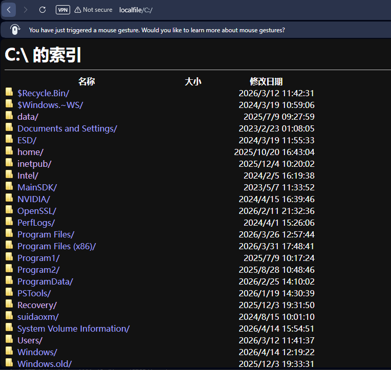

# 🚀 Proxy Bridge with Selenium & mitmproxy

## 📌 Overview
This project implements a **custom HTTP proxy bridge** using `mitmproxy` and `Selenium`.  
It intercepts HTTP requests, processes them through a headless browser, and returns the rendered or modified response.

It also includes special handlers for:
- 📂 Local file access (`file://`)
- 🧪 Controlled file exfiltration (for testing environments)

---

## ⚙️ Features

- 🔄 Intercepts HTTP traffic via `mitmproxy`
- 🌐 Uses Selenium (headless Chrome) to fetch and render pages
- 📄 Supports:
  - GET requests (fully rendered HTML)
  - POST/PUT/DELETE via `fetch`
- 📂 Local file reading support
- 📤 Exfiltration testing endpoint (base64 encoded)
- 🧵 Thread-safe WebDriver usage
- ⚡ Async + ThreadPool execution

---

## 🏗️ Architecture

Client → mitmproxy → ProxyBridge → Selenium → Response

---

## 📸 Screenshot

Example of accessing local files via the proxy:



> Shows directory listing of `C:\` accessed through `http://localfile/`

---

## 📦 Requirements

```bash
pip install mitmproxy selenium requests
